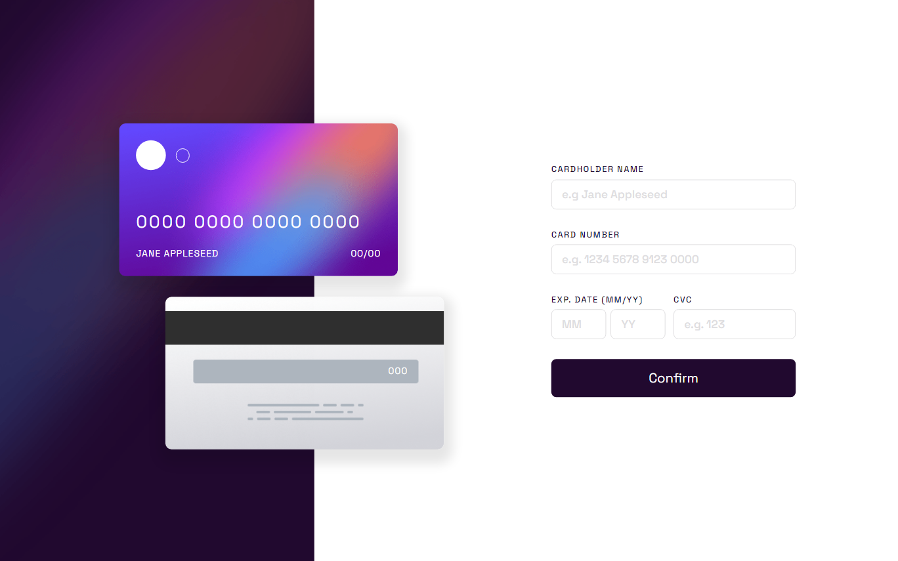

# Frontend Mentor - Interactive card details form solution

This is a solution to the [Interactive card details form challenge on Frontend Mentor](https://www.frontendmentor.io/challenges/interactive-card-details-form-XpS8cKZDWw). Frontend Mentor challenges help you improve your coding skills by building realistic projects.

## Table of contents

- [Frontend Mentor - Interactive card details form solution](#frontend-mentor---interactive-card-details-form-solution)
  - [Table of contents](#table-of-contents)
  - [Overview](#overview)
    - [The challenge](#the-challenge)
    - [Screenshot](#screenshot)
    - [Links](#links)
  - [My process](#my-process)
    - [Built with](#built-with)
    - [What I learned](#what-i-learned)
      - [HTML](#html)
      - [CSS](#css)
      - [JavaScript](#javascript)
  - [Author](#author)

## Overview

### The challenge

Users should be able to:

- Fill in the form and see the card details update in real-time
- Receive error messages when the form is submitted if:
  - Any input field is empty
  - The card number, expiry date, or CVC fields are in the wrong format
- View the optimal layout depending on their device's screen size
- See hover, active, and focus states for interactive elements on the page

### Screenshot



### Links

- Solution URL: [Interactive card details form](https://github.com/wuzgood98/interactive-card-details-form)
- Live Site URL: [Interactive card details form](https://wuzgood98.github.io/interactive-card-details-form/)

## My process

### Built with

- Semantic HTML5 markup
- CSS custom properties
- Flexbox
- Mobile-first workflow

### What I learned

I learnt how to animate a DOM element with the Element.animate() Web API. It animates even when the display property is set to none.

See code snippets, see below:

#### HTML

```html
<div class="newspaper">Spinning newspaper<br />causes dizziness</div>
```

#### CSS

```css
html,
body {
  height: 100%;
}

body {
  display: flex;
  justify-content: center;
  align-items: center;
  background-color: black;
}

.newspaper {
  padding: 0.5rem;
  text-transform: uppercase;
  text-align: center;
  background-color: white;
  cursor: pointer;
}

```

#### JavaScript

```js
const newspaperSpinning = [
  { transform: 'rotate(0) scale(1)' },
  { transform: 'rotate(360deg) scale(0)' }
];

const newspaperTiming = {
  duration: 2000,
  iterations: 1,
}

const newspaper = document.querySelector(".newspaper");

newspaper.addEventListener('click', () => {
  newspaper.animate(newspaperSpinning, newspaperTiming);
});

```

## Author

- Frontend Mentor - [@wuzgood98](https://www.frontendmentor.io/profile/wuzgood98)
- Twitter - [@wuz_goood](https://www.twitter.com/wuz_goood)
